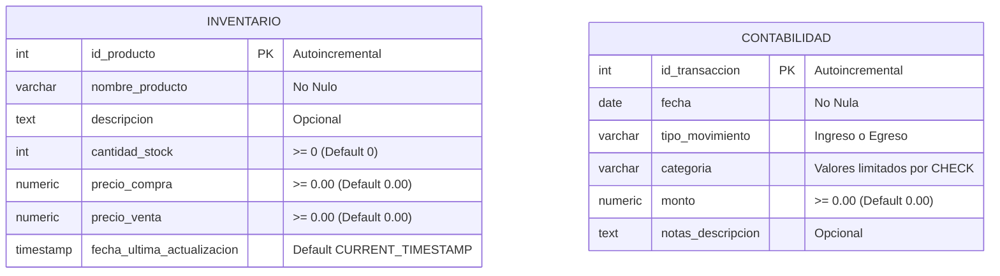

# Sistema de Base de Datos - Inventario y Contabilidad

Este repositorio contiene la estructura de base de datos para la aplicación web de gestión corporativa, dividida en dos módulos principales: **Inventario** y **Contabilidad**. 

La base de datos está diseñada aplicando reglas estrictas de integridad referencial y de dominio (restricciones de chequeo/check constraints) para asegurar la calidad de la información financiera y operativa.

---

## 📊 Diagrama de Entidad-Relación (ERD)

A continuación se muestra el esquema visual de las dos tablas principales del sistema.



---

## 📘 Diccionario de Datos

### 1. Tabla: `inventario`
Registra los productos disponibles, sus costos, precios de venta y stock actual.

| Nombre de Columna | Tipo de Datos (PG / SQLite) | Restricciones / Características | Descripción |
| :--- | :--- | :--- | :--- |
| `id_producto` | `SERIAL` / `INTEGER` | `PRIMARY KEY`, Auto-incremental | Identificador único de cada producto. |
| `nombre_producto` | `VARCHAR(255)` / `TEXT` | `NOT NULL` | Nombre descriptivo comercial del producto. |
| `descripcion` | `TEXT` | Opcional (`NULL`) | Información adicional o detalles del producto. |
| `cantidad_stock` | `INTEGER` | `NOT NULL`, `DEFAULT 0`, `CHECK (>= 0)` | Número de unidades actualmente en stock. |
| `precio_compra` | `NUMERIC(12,2)` / `REAL` | `NOT NULL`, `DEFAULT 0.00`, `CHECK (>= 0)` | Costo unitario de adquisición del producto. |
| `precio_venta` | `NUMERIC(12,2)` / `REAL` | `NOT NULL`, `DEFAULT 0.00`, `CHECK (>= 0)` | Precio unitario al que se vende al cliente. |
| `fecha_ultima_actualizacion` | `TIMESTAMP` / `DATETIME` | `DEFAULT CURRENT_TIMESTAMP` | Fecha y hora del último cambio en este registro. |

### 2. Tabla: `contabilidad`
Lleva el control del flujo de caja diario de la empresa.

| Nombre de Columna | Tipo de Datos (PG / SQLite) | Restricciones / Características | Descripción |
| :--- | :--- | :--- | :--- |
| `id_transaccion` | `SERIAL` / `INTEGER` | `PRIMARY KEY`, Auto-incremental | Identificador único de la transacción financiera. |
| `fecha` | `DATE` | `NOT NULL` | Fecha en la que ocurrió el movimiento. |
| `tipo_movimiento` | `ENUM` / `VARCHAR(10)` | `NOT NULL`, `CHECK ('Ingreso', 'Egreso')` | Clasificación general del flujo (Ingreso o Egreso). |
| `categoria` | `ENUM` / `VARCHAR(50)` | `NOT NULL`, `CHECK` (Valores permitidos) | Categoría específica del movimiento (ver tabla abajo). |
| `monto` | `NUMERIC(12,2)` / `REAL` | `NOT NULL`, `DEFAULT 0.00`, `CHECK (>= 0)` | Valor monetario de la transacción. |
| `notas_descripcion` | `TEXT` | Opcional (`NULL`) | Comentarios, número de factura u observaciones. |

---

## 🔒 Restricciones de Integridad (Coherencia de Movimientos)

Para evitar errores humanos al registrar transacciones, se implementó una regla de negocio a nivel de base de datos (`chk_coherencia_movimiento`). Esta regla valida que una categoría sólo pueda guardarse con su tipo de movimiento correspondiente:

| Categoría | Tipo de Movimiento Permitido | Tipo |
| :--- | :--- | :--- |
| `PAGO ADELANTO CLIENTE` | `Ingreso` | 🟢 Ingreso |
| `PAGO TOTAL CLIENTE` | `Ingreso` | 🟢 Ingreso |
| `COMPRA DE EQUIPOS` | `Egreso` | 🔴 Egreso |
| `REPARTO RICARDO` | `Egreso` | 🔴 Egreso |
| `REPARTO FERNANDO` | `Egreso` | 🔴 Egreso |
| `PAGO DEUDA` | `Egreso` | 🔴 Egreso |
| `PAGO PUBLICIDAD` | `Egreso` | 🔴 Egreso |
| `PAGO PERSONAL DE VENTA` | `Egreso` | 🔴 Egreso |
| `PAGO DHL` | `Egreso` | 🔴 Egreso |

---

## 💡 Ejemplos de Consultas SQL Comunes

A continuación se presentan consultas prácticas para operar la base de datos de forma eficiente.

### 1. Operaciones de Inventario

* **Registrar un nuevo producto:**
  ```sql
  INSERT INTO inventario (nombre_producto, descripcion, cantidad_stock, precio_compra, precio_venta)
  VALUES ('Laptop Dell Vostro', 'Core i5, 16GB RAM, 512GB SSD', 15, 650.00, 899.99);
  ```

* **Actualizar stock y precio tras una compra/venta:**
  ```sql
  UPDATE inventario
  SET cantidad_stock = cantidad_stock + 10,
      precio_compra = 640.00, -- Nuevo costo
      fecha_ultima_actualizacion = CURRENT_TIMESTAMP
  WHERE id_producto = 1;
  ```

### 2. Operaciones de Contabilidad (Flujo de Caja)

* **Registro correcto (Ingreso):**
  ```sql
  INSERT INTO contabilidad (fecha, tipo_movimiento, categoria, monto, notas_descripcion)
  VALUES ('2026-08-10', 'Ingreso', 'PAGO TOTAL CLIENTE', 1200.00, 'Cobro factura #1045');
  ```

* **Registro correcto (Egreso):**
  ```sql
  INSERT INTO contabilidad (fecha, tipo_movimiento, categoria, monto, notas_descripcion)
  VALUES ('2026-08-10', 'Egreso', 'PAGO DHL', 45.50, 'Envío de documentos a Ricardo');
  ```

* **Registro INCORRECTO (Rechazado por la base de datos):**
  La siguiente consulta fallará automáticamente porque `PAGO DHL` está clasificado como *Egreso* pero se intentó registrar como *Ingreso*.
  ```sql
  -- Esto lanzará un error de restricción (CHECK constraint violation)
  INSERT INTO contabilidad (fecha, tipo_movimiento, categoria, monto, notas_descripcion)
  VALUES ('2026-08-10', 'Ingreso', 'PAGO DHL', 45.50, 'Falla de coherencia');
  ```

### 3. Consultas de Reportes Financieros

* **Balance General Diario (Ingresos vs Egresos del día):**
  ```sql
  SELECT 
      SUM(CASE WHEN tipo_movimiento = 'Ingreso' THEN monto ELSE 0 END) AS total_ingresos,
      SUM(CASE WHEN tipo_movimiento = 'Egreso' THEN monto ELSE 0 END) AS total_egresos,
      (SUM(CASE WHEN tipo_movimiento = 'Ingreso' THEN monto ELSE 0 END) - 
       SUM(CASE WHEN tipo_movimiento = 'Egreso' THEN monto ELSE 0 END)) AS balance_neto
  FROM contabilidad
  WHERE fecha = '2026-08-10';
  ```

* **Resumen de Egresos agrupado por Categoría:**
  ```sql
  SELECT 
      categoria, 
      COUNT(*) AS total_transacciones, 
      SUM(monto) AS total_gastado
  FROM contabilidad
  WHERE tipo_movimiento = 'Egreso'
  GROUP BY categoria
  ORDER BY total_gastado DESC;
  ```
